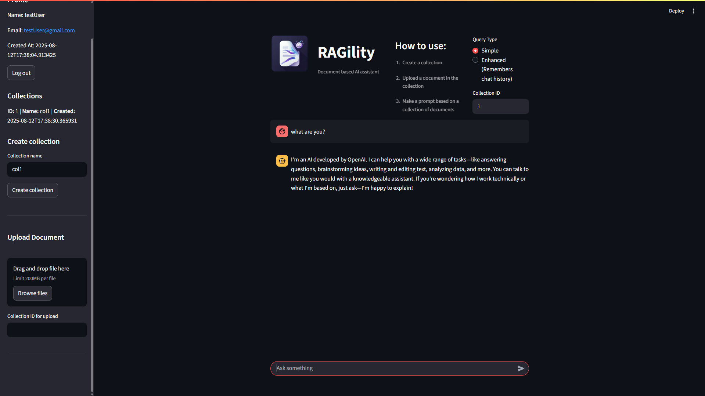

# RAGility
## This project is part of the Assist Software Intership program.

A Retrieval-Augmented Generation web application that provides a Q&A system. Built with FastAPI on the backend and Streamlit frontend.



### Features
- User registration and authentication
- Document uploading and processing
- Simple and chat based querying
- Interactive web interface
- Settings management

## Tech Stack:
- **FastAPI**, **SQLAlchemy**, **PostgreSQL**, **ChromaDB**, **LlamaIndex**, **OpenAI**, **HuggingFace**, **Streamlit**

## How to use

### Prerequisites
- Python
- Your database of choice
- OpenAI key

### Running the app

1. **Clone the repository**

2. **Create virtual environment**
   ```bash
   python -m venv .venv
   source .venv/bin/activate  # on Windows: .venv\Scripts\activate
   ```

3. **Install dependencies**
   ```bash
   pip install -r requirements.txt
   ```

4. **Environment setup**
   
   Create a `.env` file in the root directory:
   ```env
   OPENAI_API_KEY=your_open_ai_key
   OPENAI_MODEL=your_model_choice
   EMBEDDING_MODEL_NAME= BAAI/bge-small-en-v1.5 #recommended
   CHROMA_PATH=./chroma_db
   SECRET_KEY=your_seret_jwt_key
   DATABASE_URL=your_db_url #(sqlite:///./db/db.sqlite3 - simple sqlite) 
   ```

6. **Start the FastAPI backend**
   ```bash
   uvicorn main:app --reload
   ```
    Available at port 8000

7. **Start the Streamlit frontend** (in a new terminal)
   ```bash
   streamlit run front_end.py
   ```
   Available at port 8501

## RAG Implementation

### Vector Store
- Uses ChromaDB for storing document embeddings
- HuggingFace sentence transformers for text embedding

### Query Processing
1. **Simple Query**: Direct question answering without context
2. **Chat Query**: The model has the chat history as context
3. **Custom Context**: Context that can be set in admin settings
